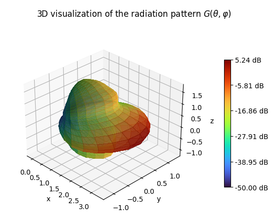

# Importer of Antenna Pattern from basic MSI files
Nowadays, SIONNA supports default radiation patterns such as: isotropic, short and half-wavelength dipoles, and TR38901 from 3GPP TR 38.901. 
Additionally, it is possible to define customized patterns using callable functions.
This repo allows to import radiation patterns from basic .msi files of antenna vendors. 
The imported radiation patterns can be added to sionna as a customized radiation pattern.

The repository contains an example of .msi file and a jupyter notebook. The jupyter notebook is divided into four blocks:

1. Imports
2. Required functions 
4. Main/Execution
5. Visualization

IMPORTANT: If the consider .msi file is different from the provided file, some modifications must be accordingly introduced.

